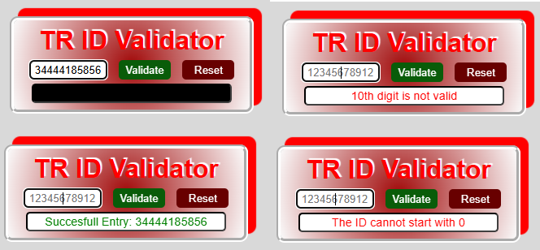

# TR ID Validator

This project is a web application developed to validate Identification Numbers. It is built using HTML, CSS, and JavaScript.

## Screenshot

## Table of Contents

- [Features](#features)
- [Technologies Used](#technologies-used)
- [Setup](#setup)
- [Usage](#usage)
- [Media Queries (Responsive Design)](#media-queries-responsive-design)
- [Project Structure](#project-structure)
- [Screenshot](#screenshot)
- [Contribution](#contribution)
- [License](#license)

---

## Features

- **TR ID Validation:** Validates the user-input 11-digit Turkish ID.
- **Validation Rules:**
  - Input must contain only numeric values.
  - Must be exactly 11 digits long.
  - The first digit cannot be `0`.
  - The 10th and 11th digits must comply with specific mathematical formulas.
- **Error and Success Messages:** Displays appropriate messages for valid or invalid inputs.
- **Reset Button:** Clears the form and validation messages.
- **Responsive Design:** Optimized for various screen sizes.

---

## Technologies Used

- **HTML:** Defines the structure of the application.
- **CSS:** Provides styling and responsive design with media queries.
- **JavaScript:** Handles validation logic and user interactions dynamically.

---

## Usage

- **Enter TR ID:** Type an 11-digit Turkish ID number into the input field.
- **Validate:** Click the "Validate" button to validate the input.
- **View Results:** If the input is valid, a success message will be displayed; otherwise, an error message will appear.
- **Reset:** Use the "Reset" button to clear the input field and messages.

## Media Queries (Responsive Design)

**The application adapts to various screen sizes:**

- <162px: Reduces text and button sizes for smaller screens.
- Larger screens: Uses the default layout and styles.

## Project Structure

tr-id-validator/
├── index.html
├── style.css
├── script.js
└── README.md
